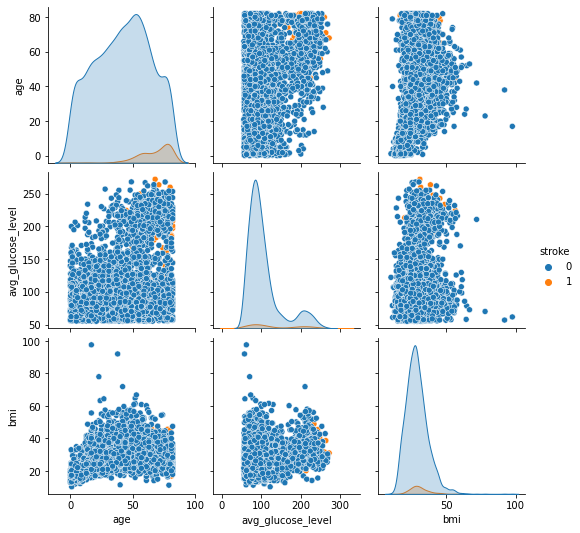
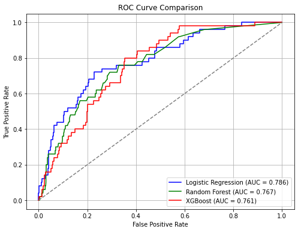
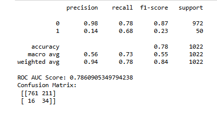

# Stroke Prediction with Machine Learning: Classification Models 

## INTRODUCTION
This project focuses on predicting the likelihood of stroke based on patient health data. Stroke is a major health concern with significant morbidity and mortality worldwide. Early identification of high-risk individuals can enable timely interventions and improve outcomes. The goal of this analysis is to build and evaluate classification models that can accurately predict stroke occurrence using demographic and medical features.

### Business Problem
Stroke is one of the leading causes of death and long-term disability, and timely prevention is often the key to reducing its impact. The challenge for many healthcare providers lies in identifying high-risk patients before symptoms appear. Rather than relying solely on reactive care, there’s a need for a data-driven approach that can flag individuals who might be more susceptible to strokes. By using machine learning to analyze patient data, this project aims to fill that gap — offering an efficient way to detect potential stroke cases early and enable preventative action.

### Stakeholder
This solution is primarily intended for hospital systems that manage large numbers of patients and aim to optimize preventive care. However, the benefits also extend to other stakeholders: insurance companies could use such models to manage risk profiles more effectively, and public health agencies may apply these insights at a broader scale to improve community health planning. Each of these groups has a vested interest in improving early detection strategies.

### Business Impact
A well-performing prediction model offers real value on multiple levels. For patients, it can mean earlier treatment, fewer complications, and a better chance at recovery. For healthcare systems, it translates to more efficient use of resources, fewer emergency interventions, and reduced long-term care costs. Over time, widespread use of predictive tools like this could lead to a noticeable drop in stroke rates, easing the burden on public health infrastructure while saving lives.

### PROJECT AIM
The goal of this project is to build predictive models that can accurately assess the risk of stroke based on individual health profiles. Using machine learning algorithms, the project analyzes medical and lifestyle-related data to uncover hidden patterns and key risk indicators. The aim is to develop a robust system capable of supporting early diagnosis and informing proactive healthcare decisions by training and comparing multiple models which ultimately contibutes to faster intervention and better patient outcomes.

# DATA DESCRIPTION
Data : https://www.kaggle.com/datasets/fedesoriano/stroke-prediction-dataset

The dataset used in this project is Stroke Prediction Dataset which contains medical records of patients and their associated risk factors for stroke. It includes the following features:

    Id: Unique identification number for each patient.
    Age: The age of the patient.
    Hypertension: Whether the patient has hypertension (1 for yes, 0 for no).
    Heart Disease: Whether the patient has a history of heart disease (1 for yes, 0 for no).
    Ever Married: Whether the patient has been married (1 for yes, 0 for no).
    Work Type: The type of work the patient does (e.g., private, self-employed, government, children).
    Residence Type: Whether the patient resides in an urban or rural area.
    Glucose Level: The patient's glucose level.
    BMI (Body Mass Index): A measure of body fat based on height and weight.
    Smoking Status: The smoking habit of the patient (e.g., never smoked, formerly smoked, currently smoking).
    Stroke: The target variable indicating whether the patient had a stroke (1 for yes, 0 for no).
    
The target variable indicates whether a patient has had a stroke. The data includes both categorical and numerical variables, requiring preprocessing before modeling. The dataset is not balanced between stroke and non-stroke cases, this causes the use of SMOTE which will enable the class balance.

# EXPLORATORY DATA ANALYSIS
Exploratory analysis was conducted to understand feature distributions and relationships with the target variable. Visualizations such as histograms, box plots, and correlation matrices helped identify patterns and potential predictors of stroke. Initial observations revealed that factors like age, hypertension, and heart disease are strongly associated with stroke occurrence. This insight guided feature selection and engineering in the modeling phase.

Some of the insights noted were:
1. The classes were highly imbalanced which called for the SMOTE process.

2. Age feature has a high relationship with the target "Stroke"

3. Generated a list of top features that are highly correlated with the target column

4. Made a pairplot to get a good view of the relationship

# DATA PREPROCESSING
The dataset required several preprocessing steps to ensure it was ready for modeling. First, a single row with the gender labeled as “Other” was dropped, as it represented a rare category and could introduce noise into the model without adding meaningful value.

Next, one-hot encoding was applied to selected binary categorical variables: gender, Residence_type, and ever_married. Using drop_first=True helped avoid multicollinearity by dropping one category from each encoded column.

For the remaining categorical variables, ordinal or label encoding was used based on the nature of the categories:

    smoking_status was mapped to numerical values:

    never smoked = 0

    formerly smoked = 1

    smokes = 2

    Unknown = 3
This preserves the general progression of exposure while allowing the model to handle the “Unknown” category explicitly.

work_type was also label encoded, with each category assigned an integer from 0 to 4:

children, Never_worked, Govt_job, Private, and Self-employed were given distinct values to reflect different occupational backgrounds.

This combination of one-hot and label encoding allowed the model to process categorical data efficiently while retaining important information. These encoded features, along with the numerical variables, were then scaled and passed into modeling.

# MODELLING

The modeling process began with a baseline logistic regression model due to its interpretability and simplicity. Hyperparameter tuning was performed using grid search to optimize regularization parameters and class weights. Subsequently, a decision tree model was trained to capture non-linear feature interactions and improve recall for stroke cases. Finally, a random forest ensemble was implemented, achieving the highest accuracy and balanced recall-precision tradeoff by aggregating multiple decision trees. Model performance was evaluated using accuracy, precision, recall, F1-score, and ROC-AUC, with special focus on recall to minimize missed stroke cases.

# Evaluation

A list of top features.

After trying out different models like Logistic Regression, Random Forest, and XGBoost, I decided to go with Logistic Regression as the best option for this stroke prediction task. The main reason is that it gave the highest recall for the stroke class, which is super important because we want to catch as many actual stroke cases as possible. Even though its precision was low, meaning there are a lot of false positives, I think it’s better to have some extra caution here rather than miss real stroke patients.

Random Forest and XGBoost had good overall accuracy, but they didn’t do as well in detecting the minority class — stroke cases. Their recall was much lower, which means they missed more actual strokes. Since the whole point is to identify those at risk, I had to prioritize recall over accuracy or precision.

Also, Logistic Regression was simpler and easier to interpret compared to the other models. It’s faster to train, and with proper tuning and threshold adjustments, there’s still room to improve its precision. So for this project, balancing between catching true stroke cases and managing false alarms, Logistic Regression is my best model.

# CONCLUSION
In this project, I worked on building a machine learning model to predict the likelihood of a stroke based on patient data. Since the dataset was highly imbalanced, I paid special attention to handling the minority class using resampling techniques and choosing the right evaluation metrics like recall, precision, F1-score, and ROC AUC.

Tested multiple models including Logistic Regression, Random Forest, and XGBoost. After comparing their results, I found that Logistic Regression performed the best in terms of recall, which is very important for this kind of health-related prediction task. Although it had low precision, I preferred it over the others because it was able to catch more actual stroke cases.

Applied hyperparameter tuning to improve each model, and the ROC curve comparison confirmed that Logistic Regression had the best balance between detecting strokes and minimizing false negatives.

Overall, this project shows how important it is to look beyond accuracy—especially when dealing with imbalanced medical datasets—and focus on the metrics that really matter for the problem at hand

